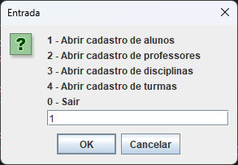
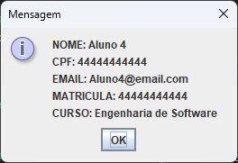
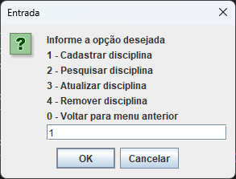
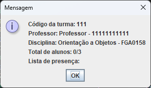
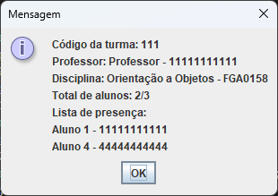

# Exemplo de Cadastro de Alunos, Professores, Disciplina e Turma

Neste exemplo apenas será feito o cadastro de alguns objetos. Este exemplo, embora não represente a totalidade do projeto, dá uma boa ideia de como o programa pode ser utilizada, de forma que o usuário possa descobrir as outras funções com facilidade.

## Cadastro de alunos

Iniciamos o programa no menu principal e logo depois nos direcionamos para o cadastro de alunos 

Após isso cadastramos nosso primeiro aluno

Informamos o nome do aluno, seu CPF, seu email, sua matrícula e por fim seu curso.

Cadastrado com sucesso podemos procurar o aluno informando sua matrícula

Após isso cadastramos mais 3 alunos que serão usados depois

## Cadastro de Professor e Disciplina

Cadastramos um professor e uma disciplina para serem atribuidas para a turma que iremos criar

## Cadastro de Turma e Matrícula de Alunos

Cadastramos uma turma informando o código da turma, o código da disciplina, a matrícula do professor e a quantidade de vagas na turma

Cadastrando a turma com sucesso podemos visualizar a turma e ver o seu código, o professor e disciplina que atribuimos, e a lista de presença, que no momento está vazia

Podemos então matricular alunos informando o código da classe e a matrícula do aluno

Matriculamos três alunos na turma e podemos ver a lista de presença cheia

Caso tente cadastrar mais um aluno uma mensagem de erro será mostrada, sendo necessário remover um aluno para matricular outro aluno

